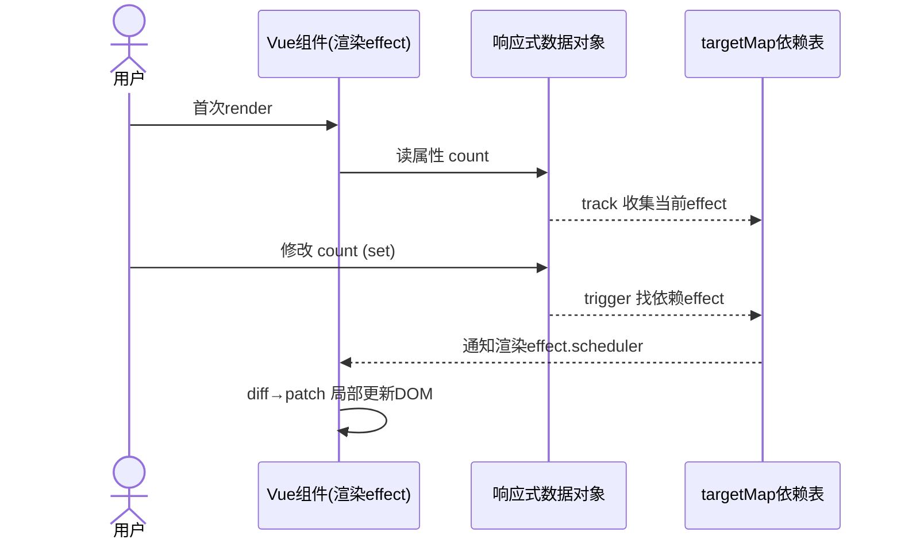

## 二、30 秒 & 60 秒自我介绍（背熟，开场致胜）

**60 秒完整版：**

> 您好，我叫吴启金，2025 年毕业于湖北民族大学计算机专业。我现在的定位是 Frontend Engineer，主攻 Vue 技术栈 + TypeScript。
>
> 之前我在韬延新能源做核心开发，负责两件事：一是储能 EMS 的跨平台移动端（uni-app + Vue3），二是管理后台（Vue2 + Element UI），同时参与后端 Spring Boot 的开发。
>
> 这个岗位要求的几件事，我基本都实战过：第一，B 端后台的核心场景，像表单、权限、数据展示，我在储能项目里实现过三级 RBAC 权限、7 种设备实时监控、数据大屏；第二，WebSocket 实时通信，我封装过带断线自动重连的客户端，能扛住跨境弱网；第三，性能优化，我在移动端处理过弱网重试、分段加载、大数据量渲染。
>
> 所以我对这个岗位的业务形态比较熟，可以很快上手，也希望能把这套在真实生产环境打磨过的经验带到团队里。

**注意：** 介绍完可以停下来观察对方反应，不要只顾着说完。

---

## 三、岗位覆盖的高频技术面试题（标准答案 + 应变要点）

下面按 JD 的考核点逐条展开。每条都给你"标准答法"和"结合你简历的加分说法"。

> 📌 **阅读提示：** 凡是带**【加分扩展】**标签的，都是我从加分提示展开成的**可直接脱口而出的完整话术**——不需要你逐字记，但希望你能用自己的话把每段的核心思想讲出来，讲到一半接上项目里真实的数字和细节就更稳。带**【进阶一问】**的是面试官可能顺着追问的延伸点，答出来是额外的"稳"。这些段落太多时**优先背**：Q31 权限、Q39 WebSocket、Q21 响应式、Q36 请求层、Q38 大数据量——这是你最有把握和最有差异化的五段。

### 3.1 HTML5 / CSS3（基础关，必须全对）

**Q1：Flex 和 Grid 的区别？什么场景用哪个？**
- 标准：Flex 是一维（一行或一列）布局，适合"沿主轴排列"的场景，比如导航、按钮组、卡片内部。Grid 是二维（行列同时可控），适合"整体网格"，比如大屏看板、九宫格、dashboard 布局。
- 加分：结合你的项目——"一卡通监控 App 我用了 flex 做外层卡片列向弹性布局，用 grid 做每个卡片内的小元素网格；储能大屏我整体用的是 grid 划分区域。"
- 【加分扩展·完整话术】"我两个项目里都用过，而且能说清为什么这么选：一卡通监控 App 外层我用了一列 flex 弹性排列卡片，因为卡片是上下叠放的；每个卡片内部则用 grid 排 2×3 的小指标，因为那是'行列都要对齐'的网格。储能全屏看板我直接给外层容器用 `grid-template-areas` 一次性规划好'实时功率 / 充放电曲线 / 收益明细'这些区域，再用媒体查询对接到不同尺寸。我的总结是——flex 管'一行'，grid 管'一张网'；如果是并列的小块就用 flex，如果是需要行列都对位的仪表盘就用 grid。"
- 【加分扩展·进阶一问】若被追"grid 怎么实现不固定的区域数"——可以用 `grid-auto-flow` / `grid-auto-rows` 让新增卡片自动流式排布，再配 `auto-fit/minmax` 做自适应列数。
- 应变：面试官抛"flex 和 grid 能不能嵌套"——当然可以，flex 负责行内排列，grid 负责区域划分。

**Q2：CSS 盒模型？box-sizing 用哪个？**
- 标准：content-box（默认，width 只含内容）+ border-box（width 含 padding 和 border）。项目中无脑用 `box-sizing: border-box;`，在 reset 里设，避免宽度被 padding 撑爆。

**Q3：CSS 实现水平垂直居中，有哪些方式？**
- 至少答 3 种：
  1. `display: flex; justify-content: center; align-items: center;`（最常用）
  2. `position: absolute;` + `top/left: 50%` + `transform: translate(-50%,-50%)`（用于脱离文档流元素）
  3. `display: grid; place-items: center;`
  4. 对单行文本可以用 `text-align: center` + `line-height`。

**Q4：CSS 动画性能？哪些属性动画不卡（重排问题）？**
- 标准：动画只应动 `transform` 和 `opacity`，这两个走合成器（compositor），不触发重排和重绘，GPU 处理，流畅不掉帧。不要对 `width/height/top/left` 做动画，那会触发 layout 重排，导致卡顿。
- 加分：你的自定义下拉刷新用了"物理阻力模型 + 贝塞尔曲线动画"，这里可以讲你是通过 transform 计算阻力位移，规避了频繁重排。
- 【加分扩展·完整话术】"这个下拉刷新是我自己封装的，正好能回答你这个性能问题。拖动时我监听 touchmove 拿到位移，套一个物理阻力模型（越过阈值后阻力系数变大，越往后越'拉不动'），但位移不是直接写在 `top/left` 上，而是换算成 `transform: translateY(...)`，这样全程走合成器，不触发 layout 重排，60fps 很稳；松手回弹我再叠加贝塞尔曲线控制回弹速度和阻尼感。核心体会：动画只动 transform/opacity，是我把刷新做成'物理反馈 + 性能友好'的关键。"

**Q5：响应式布局怎么做的？（必考）**
- 标准：三种手段——媒体查询（`@media`）按断点切换；弹性单位（rem/em/vw/vh/百分比）；flex/grid 自适应。
- 加分：你的项目用 `vw/vh 配置 rem` 适配多机型，具体讲一下思路（以设计稿宽度为基准算出 rem 基准值，用 vw 给根节点字号，实现等比缩放）。
- 【加分扩展·完整话术】"我适配多机型用的是 vm/vh + rem 的组合：设计稿一般是 375 宽，我在 html 根节点设 `font-size: calc(100vw / 375 * 10)`，这样 `10px` 的设计稿像素对应 `1rem`，并以视口宽度等比缩放；再配合构建时 `postcss-px-to-rem` 自动把设计稿 px 转成 rem，一套代码就能从 320 撑到 480，甚至平板，不用为每个档位单独写媒体查询。少数需要变形的场景（比如超大屏看板）再用 `@media` 兜底，普通页面几乎零维护。"
- 【加分扩展·进阶一问】若被问"为什么不直接全用 vw"——因为字体这种靠 vw 会在窄屏缩得看不清楚，我通常是容器/间距用 rem，字号给 `clamp()` 保底上下限。

**Q6：CSS 预处理器用过吗？SCSS 有哪些常用特性？**
- 标准：变量、嵌套、mixin（混入）、函数、@import/@use。你储能项目用了 SCSS。

**Q7：flex 子元素宽度被内容撑爆，怎么办？**
- 标准：给子元素加 `min-width: 0`，或 `flex: 1` 配合 `overflow: hidden`，解决内容不换行导致溢出。这是非常容易翻车的细节点，答出来很加分。

### 3.2 JavaScript 基础（ES6+，跟项目串着讲）

**Q8：讲讲闭包？项目里哪里用过？**
- 标准：函数能访问其定义作用域的变量，就形成闭包。本质是"作用域链 + 常驻内存"。用途：封装私有变量、缓存、防抖节流。
- 加分：你的"指数退避重试"可以用闭包思想讲（内层函数记住重试次数 state）。
- 【加分扩展·完整话术】"闭包我在实际重试逻辑里用过。做一个带退避的重试：外层函数准备一个私有的 `retryCount` 计数器和 `baseDelay`，内层返回一个 `next()`，它通过闭包能读到并累加计数，根据次数算出这次要等 `1s→2s→4s→8s` 的哪一档，再配合随机抖动。因为每个请求实例都闭包了一个独立计数器，互不污染，还不用全局变量——这就是闭包'记住自己作用域 + 封装私有状态'最典型的实战应用。"
- 【加分扩展·进阶一问】若被追问"闭包有什么代价"——闭包会让变量常驻内存，所以长生命周期的回调里别无脑引用大对象，否则内存泄漏；我会注意在不需要时解除引用。

**Q9：原型链（prototype）用来做什么？class 是什么？**
- 标准：对象通过 `__proto__` 沿原型链查找属性和方法，达到"继承复用"。`class` 是 ES6 语法糖，底层还是原型链。举例：`Array` 实例能调用 `map/filter` 就是因为沿原型链找到了 `Array.prototype`。

**Q10：Event Loop、宏任务微任务、setTimeout 0 和微任务谁先执行？**
- 标准：JS 单线程。执行顺序 = 同步任务 → 微任务（Promise.then、async 里 await 之后的、MutationObserver、queueMicrotask）→ 宏任务（setTimeout、setInterval、setImmediate、I/O）。定时器、Promise、async 基本必考，务必能画出执行顺序。
- 加分：面试官若问"为什么 401 后请求要避免重复"，可以顺势讲你是如何用单例守卫 + promise 状态来防抖的异步场景。
- 【加分扩展·完整话术】"我遇到过多个请求同时 401 的坑——如果每个都各自跳登录页，页面会反复弹登录框，甚至闪现两三次。解法是'单例守卫'：我做了一个共享的 promise 专门存'正在刷新 token 的请求'，任何请求 401 时先看这个 promise 存不存在：存在就它排队等，不存在才创建新的 refresh；刷新成功后统一 `resolve`，把排队的一整批请求一起重放。这背后的思想就是宏任务/微任务 + Promise 状态的应用：把 N 个并发的失败动作收敛成 1 次刷新、然后一起恢复，而不是各自为战。"
- 【加分扩展·进阶一问】若被问"微任务里 promise.then 为什么在 setTimeout 之前"——因为微任务在当前宏任务结束、渲染前清空；两队队列不同，promise.then 进微任务，setTimeout 进宏任务循环下一轮，所以 promise 先执行。

**Q11：Promise 是什么？async/await 本质？**
- 标准：Promise 用于解决回调地狱，有三种状态 pending/fulfilled/rejected，一旦定态不可变。`async/await` 是 Promise 的语法糖，await 会阻塞后面的同步代码但不会阻塞 JS 主线程（本质是把后续逻辑注册为 then 回调）。
- 加分：讲你封装"统一请求层 + 15s 超时 + 重试 + 401 单例"时，用的是 Promise 的状态机和 promise 队列，这段非常加分。
- 【加分扩展·完整话术】"我把整个请求层理解成一个'绝对可控的异步状态机'。每个请求本质上是一个 Promise，我做它做了四件事：第一，15 秒全局超时——用 `Promise.race([requestPromise, 超时timer])`，谁先到谁说了算，适配跨境弱网；第二，指数退避重试最多 3 次——用 `async/await` 配合 await 一个 delay，失败后按退避时间再发；第三，401 单例刷新（上面 Q10 讲过）；第四，防重复提交与可取消——接口在途时丢弃重复触发，用 AbortController 支持卸载后主动取消。这样调用方拿到的一直是一个'要么成功、要么被集中处理过'的干净 Promise，所有异常都收敛在一个地方，而不是散落在每个组件里。"
- 【加分扩展·进阶一问】若被问"Promise 三态怎么判断谁先定态、后面还能不能变"——pending→fulfilled/rejected，一旦 settled 不可逆转，所以 race/all 结果只取决于先定态的那个，且不能翻盘。

**Q12：防抖（debounce）和节流（throttle）区别？（高频）**
- 标准：防抖——停止触发后才执行（只认最后一次），适合搜索输入、resize。节流——固定时间间隔内只执行一次（保证频率上限），适合滚动、拖拽、WebSocket 消息合并。给出手写代码更好。

**Q13：深浅拷贝？手写一个深拷贝？**
- 标准：浅拷贝只复制一层引用（`Object.assign`、展开运算符）；深拷贝要递归复制嵌套对象。手写深拷贝需处理：循环引用（用 Map 缓存），不支持函数/正则/Date 的特殊值处理。项目里用 `JSON.parse(JSON.stringify())` 有坑（丢 undefined/函数/Date 变字符串）。

**Q14：== 和 === 区别？** 标准：=== 不隐式转换，== 会。项目里一律 ===。

**Q15：数组去重、数组扁平化、map/filter/reduce 的区别与手写。**

### 3.3 TypeScript（JD 明确要求，重点准备）

**Q16：为什么用 TS？相比 JS 解决了什么问题？**
- 标准：静态类型检查，编译期发现错误；IDE 智能提示；接口约束规范大型团队协作；重构安全。
- 加分："我在储能 App 里全程 TS，通过类型约束把登录类型（loginType）、设备类型、权限角色都能在编译期校验，减少线上低级 bug，这正是咱们岗位强调的'规范化开发'。"
- 【加分扩展·完整话术】"单独举一个例子说明 TS 的价值。登录分 EMS 客户端和 MEMS 管理端，我定义了一个联合类型 `type LoginType = 'EMS' | 'MEMS'`，所有跟平台分流相关的函数都把参数写成这个类型；设备 7 种类型、权限角色也都建了枚举和类型别名。这样传错平台名、打错设备类型的字符串，在编译期就报错，根本到不了线上。类型在团队里同时是'文档 + 契约'——别人接手看类型就知道该传什么，不用猜。这就是我说 TS 拿到的是'规范化开发'的原因。"
- 【加分扩展·进阶一问】若被问"TS 编译期检查挡不住运行时数据（比如后端返回非法值）怎么办"——我会在接口层做运行时校验（如 zod 或手写校验），不 100% 信任后端类型声明，编译期 + 运行时双重把关。

**Q17：interface 和 type 的区别？**
- 标准：`type` 可以用联合类型、交叉类型、工具类型组合，`interface` 支持声明合并（同名合并）、更适合对象/类契约。能用 interface 表达对象结构时优先 interface，需要组合类型时用 type。

**Q18：泛型（generic）用来做什么？项目里哪里用？**
- 标准：泛型让类型可以"随着输入变化"，从而写出通用且类型安全的函数/组件。
- 加分：你封装的"通用请求层"、"通用搜索组件"、"根据传入元素多少生成搜索框"，都可以用泛型来讲——"我希望表格封装函数时，传入什么类型的数据，返回就带着对应类型提示"。
- 【加分扩展·完整话术】"泛型我主要用在通用封装的公共组件上。比如我封装了一套'通用表格 + 逻辑抽给容器'的组件，签名大概是 `interface TableProps<T> { data: T[]; columns: ColumnConfig<T>[] }`——这样调用方传入的 `data` 是什么类型，`columns` 里配置的 `key` 字段就跟着有对应的类型提示，写错字段名编译期直接标红。通用搜索组件同理：传入的字段配置泛型化后，'按字段生成多少个搜索框'的类型也能推导出来。泛型的价值就是——一次定义、处处类型安全，不用每个调用处都去 `as` 一下。"
- 【加分扩展·进阶一问】若被问"泛型约束 extends 是干嘛的"——用它把泛型限制在某个形状上，比如 `T extends { id: string }`，保证泛型真能取到 id，是'既通用又不失控'的关键。

**Q19：泛型工具类型 常用哪些？** `Pick/Omit/Partial/Required/ReturnType/Record` 至少认识几个，且能说用途。

**Q20：类型守卫（类型收窄）？`as` 断言 vs 类型守卫区别？**
- 标准：`typeof`、`instanceof`、`in` 操作符能把宽类型收窄成具体类型；`as` 是强制断言，谨慎用。

### 3.4 Vue 核心（JD 明说"理解响应式原理、组件通信"，必考必答透）

**Q21：Vue3 的响应式原理？和 Vue2 有什么区别？（最高频，务必吃透）**
- 标准：Vue2 用 `Object.defineProperty` 劫持对象属性的 getter/setter，需递归遍历、无法监听新增/删除属性（需 `Vue.set`）、数组的索引和 length 变化有缺陷。Vue3 用 `Proxy` 代理整个对象，能监听新增/删除/索引，按需触发（`track`/`trigger`），配合 `effect` 收集依赖，性能更好、支持更多操作。
- Vue3 的 `ref` 用 `.value` 包裹基本类型，`reactive` 用 Proxy 处理对象。
- 加分收尾："我在储能项目是从 Vue2 后台到 Vue3 移动端都做过，所以能体会到这套响应式是怎么升级的，也知道哪些字段需要响应式、哪些用普通变量避免额外开销。"
- 【加分扩展·完整话术】（接源码章节后再补一句取舍）"我不仅会用 ref，还知道**什么该响应、什么不该**——比如只在初始化读一次的配置、不参与渲染的内部缓冲，我会放在普通变量里，而不是全都 `ref`，避免为不必要的数据做依赖收集和开销。举我储能项目的例子：设备列表这种要被大屏实时刷新的数据，我会用响应式 + 局部更新；而一些纯工具性的常量就走普通变量。这种'有意识取舍响应式范围'的做法，是我在生产里比只会套 `ref` 更深一层的地方。"

**Q22：Vue2 和 Vue3 项目你分别负责什么？开发体验差异？（结合简历）**
- 加分：Vue3 储能 App + 自定义下拉刷新、合理处理 ref/reactive；Vue2 储能管理后台 + ECharts 大屏、Element UI。讲"从 options API 到 setup/组合式 API，业务逻辑更容易抽成复用，我因此封装了 realtime 混入/工具函数"。
- 【加分扩展·完整话术】"两个我真刀真枪都写过，差别落点是**逻辑复用**。Vue2 后台写法偏 options API，一堆 `data/computed/methods` 平铺在组件里，同一段'管理实时数据'的逻辑想给多个页面用，只能复制或者写 mixin（mixin 有命名冲突、来源不明的老问题）。到了 Vue3 我全面改用 setup 组合式，把'WebSocket 推送 + REST 回退 + 数据新鲜度检测'抽成了一个 realtime 函数/混入，想用的页面直接 `setup` 里引用、传进配置就行。这是我从 Vue2 到 Vue3 最直观的体感：组合式 API 让业务逻辑可以在组件之间像函数一样复用，不再被组件文件结构绑架。"

**Q23：组件通信方式有哪些？（必考）**
- 逐条列全：
  - props / $emit（父子）
  - v-model（双向绑定）
  - provide / inject（祖先 → 后代，跨层级）
  - $refs / $parent / $children（实例访问）
  - Vuex / Pinia（全局状态）
  - EventBus（Vue3 已不推荐，用 mitt）
  - 插槽 slot（内容分发）
- 加分：讲"上一卡通项目里我做了'UI 与逻辑分离'，视图组件抛事件、容器组件做逻辑"——这正好体现你对组件通信和职责划分的理解。
- 【加分扩展·完整话术】"我做过'容器组件 vs 展示组件'的拆分，这正是组件通信用起来最顺的地方。我封了一个通用搜索组件：它只负责根据传入的字段配置去渲染出对应数量的搜索框、做内部布局和校验，一旦用户点搜索/重置，它只把'筛选参数对象'通过 `$emit` 抛出来，一点不碰接口逻辑；真正调接口、拼接查询条件、刷新表格都在容器组件 index 里做。表单项也类似——我封装了通用表格，数据展示在内部，但增删改查这些逻辑操作同样抛给容器。这样组件职责单一、可复用，改样式不动逻辑、改逻辑不动样式，这也是我这边组件能二次复用很多次的原因。"

**Q24：v-if 和 v-show 区别？** v-if 真正销毁/重建节点（减少初始渲染成本、不影响首屏），v-show 只切 display（切换频繁时性能好）。

**Q25：computed 和 watch 区别？**
- 标准：computed 有缓存、依赖响应式数据变化才重算，用于"由已有状态派生"；watch 用于"监听某个值变化后做副作用"（调用接口、联动）。能加"computed 是惰性的、getter 必须是纯的"。

**Q26：nextTick 用途？**
- 标准：Vue 的 DOM 更新是异步批量的，nextTick 在 DOM 更新完成后执行回调。场景：改数据后立刻要操作 DOM / 获取新高度。

**Q27：key 的作用？为什么要用稳定的 key？**
- 标准：key 帮 diff 算法复用节点，用 index 作 key 在列表增删/重排时会出现复用错误（状态错乱）。用唯一 id 最稳妥。讲一卡通表格+搜索列表能用到。

**Q28：生命周期钩子？组合式 API 生命周期写法？**
- Vue3 组合式：`onMounted / onUpdated / onUnmounted / onBeforeUnmount` 等与 `setup`。必答核心：`onMounted` 发请求、`onBeforeUnmount` 清理定时器/断开 WebSocket——正好接你的 WebSocket 清理。

**Q29：Pinia 和 Vuex 区别？（JD 提到 Pinia/Vuex）**
- 标准：Pinia 更简单（去掉了 mutation、直接用 options/composition 风格）、更轻量、对 TS 友好、无命名空间概念；Vuex 有 state/getters/mutations/actions 严格区分。
- 加分：你的储能项目里"在 pinia 中初始化 WebSocket 连接、数据存 state"，用状态集中管理实时数据。
- 【加分扩展·完整话术】"我把 Pinia 和实时数据绑定来用。储能 App 首次进入时，在 store 里初始化 WebSocket 连接，把推送来的 PCS 功率、BMS 电量这些关键指标写进 state；所有页面都从同一个 store 读数据，天然满足'单一数据源 + 跨页面共享'，不会每个页面各自连一遍。而且卸载时我只清理当前页面的订阅、不去断掉 store 里的主连接，避免反复建连。选 Pinia 是因为它天然对 TS 友好、没有 Vuex 那层 mutation 的心智负担，写起来接近普通函数。"
- 【加分扩展·进阶一问】若被问"Pinia 多实例同 name 会不会串"——不会，Pinia 靠全局 store 注册，同一 name 只有一份；不同页面复用同一 store 就是同一份数据。

**Q30：路由懒加载？动态路由怎么做的？**
- 标准：路由级代码分割（`component: () => import(...)`）减少首屏。动态路由：根据后端返回的权限/菜单信息 `router.addRoute()` 动态注册，配合路由守卫做访问控制。
- 加分：你的"路由守卫（role + deviceType 校验）+ v-permission/v-role 自定义指令"就是这个。这几乎是本岗位的核心考点，务必能讲清请求流程。
- 【加分扩展·完整话术】"我路由是'懒加载 + 动态注册'结合。懒加载很简单：每个页面用 `component: () => import('./xxx.vue')`，让 Webpack/Rollup 自动按路由分割成独立 chunk，首屏只加载当前用的。动态路由这块，我登录后拿角色，前端维护一张'角色 → 可访问路由表'，白名单页面（登录、403）常驻，业务页面按权限用 `router.addRoute()` 动态加进去；刷新页面后重新拉一次权限、恢复路由。访问控制再配合 `beforeEach` 路由守卫校验——是登录态 + 该用户的 role/deviceType 允许的角色才放行，否则重定向。一句话：动态注册管'能不能有这个路由'，路由守卫管'这个用户能不能进'。"

**Q31：Vue 中权限控制你具体怎么实现？（B 端核弹级问题，重点准备）**
- 参考回答框架（结合你的三级 RBAC）：
  1. 登录后拿角色，前端存 role/权限标识。
  2. 顶层：路由守卫 beforeEach 里校验是否登录 + 是否有该路由的访问权限（role + deviceType），无权限重定向 403/登录。
  3. 页面层：自定义指令 `v-permission="'xxx'"` 控制按钮/模块显隐（DOM 控制）。
  4. 后端层：接口也做二次校验（前端只是体验，后端才是安全边界）。
  - 强调：权限是前端体验 + 后端安全的双保险。
- 【加分扩展·完整可背叙述版】（面试官问"权限怎么实现的"就把这段复述出来）：
  > "我是按三层去做权限的，核心原则是**前端管体验、后端管安全**。
  > 第一层是路由层：登录后拿到当前用户的角色和数据类型（我们分 ADMINISTRATOR / USER / OTHER 三级，还牵扯 EMS / MEMS 两种业务端），前端根据角色维护一张可访问路由表，白名单（登录、403）常驻，其余按权限用 `router.addRoute()` 动态注册；同时 `beforeEach` 守卫里校验——既有登录态，又判断访问的目标路由是否被该 `role + deviceType` 允许，不允许就重定向到 403 或登录页。
  > 第二层是页面/按钮层：我封装了 `v-permission` / `v-role` 两个自定义指令，在 DOM 层面控制按钮、TabBar、菜单项显隐。比如某按钮只给管理员，就 `<button v-role="'ADMINISTRATOR'">`，底层判断通过才渲染，通过 Vue3 的指令生命周期在 `mounted` 时就渲染或不留下节点，避免出现'按钮在但点了才报无权限'的尴尬。
  > 第三层必须强调：**前端权限只是体验优化，不是安全边界**。后端接口一定要再用同一个角色/权限做二次校验，前端防的是误操作和更好的体验，后端防的是绕过前端直接调接口。这也是我这套能在生产环境放开的原因。
  > 另外我还做了'跨端权限上下文感知'——同一个账号在管理端和移动端看到的能力能保持一致，因为两端判定都来自同一套角色，没有各自维护一份造成不一致。"

### 3.5 Vue Router / 工程化 / 构建（Vite & Webpack）

**Q32：Vite 和 Webpack 区别？为什么 Vite 更快？**
- 标准：Vite 开发环境用原生 ESM + esbuild 预构建，启动和热更新都快（按需加载、不需要每次全量打包）；Webpack 是 bundle 打包器，需要依赖图谱分析、启动慢但在复杂工程和兼容性/插件生态上更成熟。两者打包产物方式不同（Vite 用 Rollup 打包）。
- 加分：你在两个项目分别用过 Vite5 和 Webpack5，能对比开发体验。
- 【加分扩展·完整话术】"两个我都实战过，差别不只是快慢。储能 App 是 Vite5：冷启动基本秒开、HMR 快到改代码立即热更，因为它开发时用原生 ESM + esbuild 预构建，浏览器按需 import，不需要先全量打包；生产用 Rollup 打包。储能后台是 Webpack5：启动确实要构建依赖图、慢一些，但插件生态和精细化配置更全，我甚至用它 `DefinePlugin` 注入版本号做自动更新检测。我的选择习惯是——新工程用 Vite 享受开发体验，老工程/需要深度定制构建流程就留在 Webpack，两者不是替代而是场景不同。"

**Q33：Webpack 打包优化手段了解哪些？（增分题）**
- 分模块答：
  - 代码分割：`splitChunks` 抽公共包、路由懒加载；
  - 体积：tree shaking、按需引入（Element Plus 按需）、压缩（terser）、CDN 引入大依赖；
  - 速度：`thread-loader` / 多进程、`cache-loader` 缓存、`DllPlugin` 预编译；
  - 其他：`externals` 外部化。你在储能后台里用 webpack 注入版本号做自动更新检测，这里是加分细节。
- 【加分扩展·完整话术】"除了常规的 splitChunks 抽公共包、路由懒加载、tree-shaking、按需引入（Element Plus 我都是按需）、压缩抽 CDN 之外，讲一个别人少提的实战点——我用 webpack 做**前端自动更新兜底**：打包时用 `DefinePlugin` 把当前构建版本号注入进去，前端每隔 30 秒轮询一个 `version.json` 比对版本，发现线上已是新版本且没有正在操作的用户时提示'有新版本，点击刷新'，5 分钟内对同一提示去重。这样用户不必每次发布都被强刷，长期挂着的后台页面也能自己感知到更新。这算是我把那句'工程规范与稳定性维护'落到实处的例子。"

**Q34：Git 常用命令？分布式 vs 集中式？分支管理？**
- 必会：`git add/commit/push/pull/fetch`、`merge/rebase`、`stash`、`log`、`checkout/reset/revert`。能解释 merge 和 rebase 区别，能讲团队的 feature 分支流程规范。

**Q35：HTTP 请求流程？（连带网络优化）**
- DNS 解析 → TCP 三次握手 → 发送 HTTP 请求 → 服务端响应 → 浏览器解析渲染。能讲状态码：200/301/302/304/400/401/403/404/500/502——你简历写到熟悉状态码、服务端做了响应码错误提示，可结合。

**Q36：Axios 拦截器？请求取消？常见坑？**
- 标准：请求/响应拦截器统一注入 token、统一处理错误和 loading；用 `AbortController`（axios 里 `CancelToken` 或 `signal`）取消请求，解决组件卸载后回调更新、防重复提交。
- 加分：你的 401 单例守卫 + 防重复提交守卫 + 15s 超时 + 指数退避重试，全串起来讲，这是本项目的高光。
- 【加分扩展·完整话术】"我把这套请求层完整串一遍，它是我在储能项目里最有代表性的封装。**拦截器层**：请求拦截器统一注入 Bearer Token、X-Tenant 租户头、loginType 登录类型头，调用方不用每次写；响应拦截器统一收错误。**健壮性层**：15 秒全局超时（用 Promise.race 跟一个 timer，适配跨境弱网）；失败按指数退避重试最多 3 次。**状态层**：401 走单例守卫只刷新一次 token、刷新后重放排队请求，避免整批跳登录。**体验层**：防重复提交——同一接口在途时丢弃重复触发；用 AbortController 支持主动取消，组件卸载就 abort，避免卸载后回调再去 setState 报错。整套下来，业务组件只需要 `await api.xxx()`，其余全都是这层替我兜底。"

### 3.6 性能优化（JD 进阶要求，准备到位）

**Q37：页面加载性能优化有哪些？（必答）**
- 分四层答：
  1. 资源加载：图片懒加载、CDN、压缩（gzip/brotli）、字体 `font-display:swap`、HTTP 缓存（强缓存+协商缓存）。
  2. 构建层面：路由懒加载、代码分割、按需引入、抽取公共包。
  3. 渲染层面：减少重排重绘、`content-visibility:auto` 长列表跳过渲染、骨架屏、`loading` 占位。
  4. 首屏：骨架屏 + 核心数据优先请求 + 关键 CSS 内联。

**Q38：大数据量渲染怎么优化？（B 端高频，正好你做过大屏/监控）**
- 标准答法：
  - 虚拟列表/虚拟滚动（只渲染可视区），或用 `content-visibility`。
  - 分批渲染（分页 / requestAnimationFrame 分帧）。
  - canvas 替代大量 DOM（ECharts 大屏本身走 canvas）。
  - 减少 DOM 数量和重绘。
- 加分：结合储能后台"7 种设备实时监控 + 全屏数据看板"，讲你用 ECharts（canvas 渲染）承接高频实时数据、配合分段加载缓解链路压力。
- 【加分扩展·完整话术】"这个我正面回答，储能后台恰好就是大数据量问题。我的思路是'四个少'：**少请求**——实时指标走 WebSocket 增量推送，而不是整表轮询重拉；**少 DOM**——大屏图表用 ECharts，本质是 canvas 渲染，几万个点也能刷住，不会堆几万个 DOM 节点；**少渲染**——长列表用分页或 `content-visibility: auto` 按需渲染，滚动到哪加载到哪；**少抖动**——高频刷新用 `requestAnimationFrame` 合并每帧的更新，配合分段加载（先返概览、再按需拉明细）缓解首屏和链路压力。核心原则一句话：让浏览器每一帧只做必要的工作，用增量 + 分层去打'数据大'，而不是硬扛。"
- 【加分扩展·进阶一问】若被追问"canvas vs DOM 各自怎么选"——图表量大走 canvas（不占 DOM、GPU 快），但要交互点选、需要无障碍时 DOM/SVG 更好；我大屏指标用 ECharts 走 canvas，简单列表用 DOM + 虚拟滚动。

**Q39：WebSocket 连接和重连策略？（JD 明标，重点）**
- 标准要点：
  - 监听 onopen/onmessage/onerror/onclose；
  - 重连做指数退避（1s→2s→4s…，设上限）并加抖动（jitter）防止风暴；
  - 心跳检测（ping/pong）保持连接；
  - 关闭后清理资源，避免内存泄漏；
  - 弱网降级：WebSocket 失败时回退到 REST 轮询。
- 加分：你的 `ResilientWebSocket`（指数退避 1s–30s + 贝塞尔抖动）和 realtime 混入（WS + REST 双通道回退、20s 数据新鲜度）就是完整答案，直接复述项目即封神。这段务必准备好手绘时序图。
- 【加分扩展·封神版完整话术】（面试官问 WebSocket 就把这段背出来，分段讲）：
  > "这个我有一整套生产验证过的方案。先说**连接层的健壮性**：我封装了 ResilientWebSocket，断线自动重连，重连间隔从 1 秒起步、指数退避到 30 秒封顶，并且加了贝塞尔抖动——为什么要抖动？因为如果几万个客户端同时断线、又按同一个退避时间同时重连，会把服务端打成雪崩；加一个随机抖动把重连时间错开。
  > 然后是**心跳保活**：客户端定时发 ping，服务端回 pong，超时判定连接假死就主动重连。
  > 最关键的是**弱网降级（双通道回退）**：我做了个 realtime 混入，主通道是 WebSocket 推送，但加了一道'20 秒数据新鲜度检测'——如果超过 20 秒没有新数据进来，就判定 WS 链路可能已假死，自动切到 REST 轮询兜底拿最新数据，连上后再切回 WS。这样恶劣网络下数据也不会断。
  > 还有**内存安全**：组件卸载时 onBeforeUnmount 里清理监听、断掉连接，避免订阅泄漏。
  > 这套组合拳帮我扛住了跨境弱网场景，也把实时性从'能用'做到了'稳定'。"

### 3.7 前端安全（简历写了，需能对口）

**Q40：XSS 和 SQL 注入是什么？怎么防？（简历技能第 9 条）**
- XSS：通过注入可执行脚本窃取/篡改。防御用转义输出、`text/v-bind` 默认不执行 `v-html` 慎用、CSP 头、HttpOnly cookie。
- SQL 注入：伪造输入拼进 SQL。后端用参数化查询 / 预编译（PrepareStatement），前端也要白名单校验。

---

## 四、项目深挖追问题库（针对你简历真实经历，必背）

面试官一定围绕项目问"What 为什么 如果"。每个项目准备"你怎么做的 + 为什么这么选 + 遇到过什么坑 + 怎么权衡"。

### 项目1 ｜ Taoyan EMS 储能管理移动端 + 管理后台（Vue3/uni-app，重点中的重点）

**预设追问 & 参考回答方向：**

Q：**为什么用 uni-app？跨端怎么解决差异？**
A：需求是 H5 + 微信小程序 + 原生 App 三端一套，uni-app 用 Vue 语法一站式交付，成本低于维护三套。跨端不一致是我踩过的坑——比如 uni-app 原生下拉刷新三端表现不一致，我自己封装了自定义下拉刷新（物理阻力模型 + 贝塞尔曲线动画）来统一体验。

Q：**双端架构（EMS/MEMS 共用登录入口）怎么设计？**
A：同一个登录入口，根据 `loginType` 自动切换客户端。MEMS 管理员生成一次性 Token 模拟登录 EMS 用户，实现跨端委托访问——讲清这是为满足"管理员代运营客户账号"的业务诉求。

Q：**三级 RBAC 权限怎么做？**
A：ADMINISTRATOR/USER/OTHER 三级；用角色驱动 TabBar 显隐、页面访问权限、设备操作权限；跨端权限上下文感知（移动端/后台感知同一套角色）。强调"前端限制体验 + 后端接口二次校验"双保险。

Q：**统一请求层封装了什么？为什么 15s 超时？**
A：自动注入 Bearer Token、X-Tenant（租户头）、loginType 头；15s 全局超时是为适配跨境弱网；指数退避重试最多 3 次；401 单例守卫——避免多个请求同时 401 各自跳登录，重复跳转。用 Promise 状态机 + 队列实现单例刷新机制。

Q：**WebSocket 实时推送 + 数据刷新怎么做？**
A：PCS 功率、BMS 电量等关键指标实时刷新；配合分段级加载 + 错误状态管理。讲 ResilientWebSocket 的断线重连与 WS/REST 双通道回退。

Q：**乐观更新 + 失败回滚为什么用？**
A：系统启停、模式切换这类高频操作，若不乐观更新用户会等很久。先本地更新再请求，失败回滚，配合防重复提交守卫，既快又稳。

Q：**三语国际化怎么做？**
A：zh-CN/en-US/zh-TW，后端偏好同步 + 本地缓存 + 模糊错误消息匹配映射（后端错误码匹配前端文案）。

### 项目2 ｜ EMS 储能管理后台（Vue2 + 大数据量 + 大屏，贴合岗位 B 端核心）

Q：**管理后台你做了哪些模块？**
A：租户审核、设备注册、用户管理、登录日志、系统配置、平台数据大屏；EMS 客户端后台做 7 种设备实时监控、充放电统计、峰谷电价分析、收益明细、全屏看板。

Q：**7 种设备实时监控的数据怎么渲染？性能怎么保证？**
A：实时数据走 WebSocket；大屏用 ECharts（canvas）承接高频指标；数据量大时用分页 + 分段加载，减少首次请求压力。聊"大数据量渲染优化"。

Q：**多租户怎么隔离？**
A：Axios 层注入 X-Tenant 头，后端按租户路由；登录时带出的登录类型决定看哪个租户的哪套后台。

Q：**后端你也参与，做了什么？**
A：维护 WebSocket 实时推送端点、InfluxDB 时序数据查询（Flux 分钟级聚合 + MySQL 自动回退）、平台大屏接口。讲"我能理解前后端边界，联调效率高"。

### 项目3 ｜ 全球通 VPN 客户端（Electron + 支付，体现工程化广度）

Q：**支付系统集成做了什么？**
A：微信（JSBridge 6 参数签名）+ 支付宝；订单创建、回调验证、防重放攻击（24h TTL 去重）、滑动窗口限流（60s/10 次）、订阅生命周期（创建/续费/过期/自动续期）、多级到期提醒、试用管理。

Q：**Lit Web Components 和 Vue 有什么区别？（暴露你用过非 Vue 技术）**
A：Lit 是 Web Components 的轻量框架，用原生自定义元素 + 响应式模板；Vue 有完整生态（Router/State 管理）。我会两套，能迁移到 Vue 组件或做跨框架组件。

Q：**66 语言国际化怎么做？**
A：intl-messageformat 做最佳匹配与变体回退。

Q：**从 Polymer 3 迁移到 Lit 3 怎么保证兼容？**
A：渐进式迁移，新组件统一 Lit3.2，与遗留 Polymer 组件共存运行，分批替换，降低一次切换风险。

（说明：VPN/翻墙类产品仅做技术表达时点到为止，如面试官细问业务合规性，表达"我在项目里负责技术实现"即可，不展开敏感细节。）

### 项目4 ｜ 湖北民族大学一卡通管理系统（项目量大，体现你基础扎实）

Q：**为什么要封装统一 API 代理接口？**
A：解决内网/外网安全问题——前端只把请求发给一个 proxy 代理，代理判断通过后才转发到学校内网取数据再返回，避免接口直接暴露在外网，保证数据安全通信。

Q：**组件封装怎么做 UI 与逻辑分离？**
A：视图组件只负责展示，把事件（upload/change/save）抛给容器组件处理逻辑；通用搜索组件按传入的字段数量动态生成搜索框；table/form 组件封装，内部展示数据、逻辑抛给容器 index 处理。这是很好的"职责分离"答案。

Q：**LocalStorage 做什么用？**
A：跨页面数据持久化，降低页面间通信成本、优化读取性能。

### 项目5 ｜ 湖北民族大学一卡通监控 App（体现你前端手写能力）

Q：**响应式布局怎么做的？**
A：flex 外层列向弹性 + grid 内层网格；vw/vh 配 rem 实现按设计稿等比缩放，适配多机型。

Q：**WebSocket + Pinia 实时数据怎么组织？**
A：首次进入在 Pinia 初始化 WS 连接，数据进 state；WS 定时从服务器拉数据更新 state，页面响应式渲染。定时器/连接记得卸载时清理。

Q：**手写 SCSS 动画怎么做的？**
A：监听数据变化，数据变化时执行数据流动的动画效果。

---

## 四点五｜Vue 响应式源码级讲解（必杀技，能讲透就是加分顶格）

> 这个岗位 JD 明说"理解 Vue 响应式原理"，但大部分应聘者只会背"Vue3 用 Proxy、Vue2 用 defineProperty"。你能讲到下面的"收集依赖 + 派发更新"机制和调用链，基本就赢了这一问。用自己能讲顺的话复述。

### 1. 一句话说清"响应式是什么"

> **答：** 当你读取响应式数据时，正在运行的"副作用函数"会被登记成订阅者；当你改数据时，通知这些订阅者去重跑。数据一变，用到它的地方（视图/计算）自动更新。

它就是把"数据 → 视图"这套自动联动用代码固化成"读即收集、写即通知"两个动作。

### 2. 两个根基数据结构：targetMap / Track / Trigger

Vue3 的响应式源码核心就是 `reactive.ts` 里这三个东西（伪代码，帮你记住结构）：

```js
// 核心："对象 -> 属性 -> 依赖集合" 的多层 Map
const targetMap = new WeakMap(); // 外层：target(响应式对象)
//   └── depsMap = new Map()     中层：key(属性)
//        └── dep = new Set()    内层：effect 副作用函数集合

// 读数据时收集依赖：
function track(target, key) {
  // 1. 取当前正在执行的 activeEffect
  const dep = getDep(target, key);
  dep.add(activeEffect);           // 把这个 effect 登记为"生成者"
}
// 写数据时派发更新：
function trigger(target, key) {
  const dep = getDep(target, key);
  dep.forEach(effect => {          // 通知所有依赖该属性的 effect
    if (effect.scheduler) effect.scheduler(); // 有调度器(如组件更新/computed)走调度器
    else effect.run();             // 否则立刻重跑
  });
}
```

**记忆口诀：** `WeakMap(对象) → Map(属性) → Set(依赖函数)`，读时 `track` 加，写时 `trigger` 通知。

### 3. Vue3 用 Proxy + Reflect 全对象代理

Vue2 只能逐属性手脚，Vue3 直接代理整个对象，所以"新增属性、删除属性、数组索引/长度"都能被感知（这正是 Vue2 的死穴）。

```js
function reactive(target) {
  return new Proxy(target, {
    get(target, key, receiver) {
      track(target, key);                    // 读 → 收集
      const res = Reflect.get(target, key, receiver); // 关键是 receiver，保证 this 指向代理对象
      // 若结果是对象，递归转化（懒代理，用到才转，提升性能）
      return isObject(res) ? reactive(res) : res;
    },
    set(target, key, value, receiver) {
      const res = Reflect.set(target, key, value, receiver);
      trigger(target, key);                  // 写 → 通知
      return res;
    },
    deleteProperty(target, key) {            // 处理 delete obj.key
      const res = Reflect.deleteProperty(target, key);
      trigger(target, key);
      return res;
    },
    // has / ownKeys 也要实现，否则 for...in 不响应
    ownKeys(target) {
      track(target, ITERATE);                // 收集迭代依赖
      return Reflect.ownKeys(target);
    },
  });
}
```

**面试官常追问的两个细节：**
- **为什么 get 里用 Reflect.get + receiver？** 因为当对象有 getter，且 getter 内部访问 `this` 时，`receiver` 保证这个 `this` 是代理对象而不是原始对象，否则会绕过代理、漏掉依赖收集。这是 Vue3 源码里最容易考到的"坑"。
- **为什么是懒代理？** 只用 `reactive()` 包了一层，嵌套对象是"访问到才递归代理"的（`isObject(res) ? reactive(res)`），避免了 Vue2 那种初始化就递归遍历整个对象树的性能损耗。

### 4. ref / reactive / computed 各自怎么实现

**ref：** 基本类型没法被 Proxy 代理，所以 ref 用一个"包装对象"兜着（真实源码是 `RefImpl` 类）：

```js
class RefImpl {            // 源码简化为概念
  _value;  _rawValue;
  dep = new Set();         // 这个 ref 自身的依赖
  get value() {
    trackRefValue(this);   // 收集
    return this._value;
  }
  set value(newVal) {
    if (Object.is(newVal, seen(this._value))) return; // 变化才触发
    this._value = toReactive(newVal); // 若是对象自动转 reactive
    triggerRefValue(this); // 通知
  }
}
```
要点：ref 的 `.value` 既是 getter 也是 setter；只要值是对象，ref 内部会转成 reactive，所以 `ref({a:1}).value.a` 也是响应式的。

**reactive：** 就是上面第 3 节那个 Proxy。

**computed：** 惰性求值 + 缓存，核心是 `dirty` 标志 + `lazy effect`：

```js
class ComputedRefImpl {
  _value; dirty = true;  // 脏标记：首次为 true，求值后置 false
  fn; // 传入的计算函数
  constructor(fn){
    this.effect = new ReactiveEffect(fn, () => {
      // scheduler：依赖一旦变化，不立刻重算，而是把 dirty 置回 true
      if (!this.dirty) { this.dirty = true; triggerRefValue(this); }
    });
  }
  get value() {
    trackRefValue(this);      // 读取的人也登记
    if (this.dirty) {
      this._value = this.effect.run(); // 首次/变脏时才真正算
      this.dirty = false;
    }
    return this._value;
  }
}
```
**面试必答点：** 为什么 computed 有缓存而 method 每次调用都重算？因为 computed 用 dirty 标志 + 惰性 effect，依赖不变就返回上次结果。

### 5. 依赖收集的"执行环境"：ReactiveEffect / activeEffect

上面的 `activeEffect` 哪来的？是 `reactiveEffect.ts` 里的全局变量，配合 effect 调度栈：

```js
let activeEffect;                 // 当前正在运行的 effect
class ReactiveEffect {
  deps = [];                      // 反向记录自己依赖了哪些 dep（用于卸载清理）
  constructor(fn, scheduler) {}
  run() {
    activeEffect = this;          // 进栈，标记"当前在跑这个 effect"
    cleanup(this);                // 先清掉旧依赖，重新收集，避免"条件分支里过期的依赖"残留
    this.fn();                    // 执行，期间访问响应式数据 → track 把 this 收进去
    activeEffect = null;
  }
}
```
**一个高频且难的问题**："为什么 effect 要在每次 run 前先 cleanup 清掉旧依赖？" —— 因为依赖会随 `if` 分支而变（比如 `effect(() => ok ? a : b)`），如果不先清旧的，等 `ok` 翻面时 b 仍被无用收集，导致多余触发。这是源码里"动态分支依赖"的经典考点。

### 6. 组件渲染怎么接进这套响应式（完整调用链）

这是把源码讲得串起来的一问，面试官最想听：

1. `render()` 渲染函数本质是个 effect（`ReactiveEffect`）。
2. 首次渲染时，render 读取模板里用到的响应式数据（如 `count`）→ 触发 `get` → `track` 把当前渲染 effect 登记为 count 的依赖。
3. 之后你改 `count` → 触发 `set` → `trigger` 通知渲染 effect → 组件 `patch` 更新对应 DOM（只更新变化的节点，不是整页重渲染）。
4. 组件卸载（`unmounted`）→ 调用 effect 的 stop / cleanup，解除依赖，避免泄漏。

**你要能现场画出这条链：** `set 数据 → trigger → 渲染effect.scheduler → 组件更新(prevTree→newTree diff → patch DOM) → 重新 track`。这同时解释了"为什么 Vue 数据变了，只有 UI 局部变"。

### 7. Vue2 用 defineProperty 的差异（对比着讲最显深度）

```js
// Vue2：Object.defineProperty 逐属性劫持，初始化时必须递归遍历
Object.defineProperty(data, key, {
  get() { dep.depend(); /* 收集 */ return value; },
  set(newV) { value = newV; dep.notify(); /* 通知 */ }
});
// 数组：Vue2 只能重写 push/pop/shift/unshift/splice/sort/reverse 这 7 个方法
```

**Vue2 三个致命局限（背下，正是 Vue3 升级理由）：**
1. 对象**新增/删除**属性不响应 → 需 `Vue.set` / `this.$set`（Vue3 的 Proxy 天然支持）。
2. 数组按**索引赋值**、**直接改 length** 不响应。
3. 初始化要**递归遍历**整棵树，深对象初始化慢、并发死（大对象性能差）。

**一句话收尾：** "Vue2 是对象级自理，Vue3 是整对象代理 + 懒递归，所以 Vue3 更快、能监听更多操作（增删、for...in、in），这也解释了为什么我在 Vue3 项目里不需要 Vue.set。"

### 8. 这一节的口语化串讲模板（直接背，30 秒版）

> Vue 的响应式，我理解为"读时收集依赖、写时通知更新"两个动作。
> Vue3 用 Proxy 代理整个对象，读属性走 `track` 把当前正在渲染的 effect 记进依赖表（WeakMap→Map→Set），写属性走 `trigger` 通知这些 effect 去更新；`ref` 用带 `.value` 的包装类兜基本类型，`computed` 靠 dirty 标志做惰性缓存；组件 render 本身就是一个 effect，所以属性一改，只有用到它的那个 DOM 局部更新。
> 这套比 Vue2 的 defineProperty 强在：能监听到新增、删除、数组索引和 for...in，而且懒递归、不用 Vue.set，性能和能力都更好。这两个我都在生产项目里实际用到了。


（若你面试现场白板画这张图，面试官一般就放心了。）

---

## 五、手写题 / 场景题（面试常要求现场写，选 6 个练熟）

1. **手写防抖 / 节流函数**（最高频）。
2. **手写深拷贝**（考虑循环引用、基本类型、数组）。
3. **手写 Promise.all / Promise.race**（展示异步功底）。
4. **浅谈并发限制并发加载资源**（n 个请求并发上限 m，用队列控制）——对应你的请求层并发控制。
5. **手写一个简单的 Vue 响应式**（用 defineProperty 或 Proxy 做 getter 依赖收集 + setter 触发更新）。
6. **数组去重 / 扁平化 / 手写 reduce**。
7. **实现带超时、重试、取消的请求封装**（结合你简历讲）——口头手写伪代码即可。
8. **判断一个对象是否为空、深浅合并**。

Ending（一题一句提醒）：任何手写题都要"先讲思路再说代码"，写之前问清输入输出约束，写完主动用一两个用例自测。

---

## 六、行为面试（STAR 法，结合经历）

原则：`Situation（背景）→ Task（任务）→ Action（行动）→ Result（结果/数据）`。每个问题 60-90 秒，含数字。

**Q1：讲一个你解决的最有挑战的技术问题。**
- STAR 建议：储能 WebSocket 在跨境弱网下频繁断线 → ResilientWebSocket 指数退避重连（1s–30s + 贝塞尔抖动）+ WS/REST 双通道回退（20s 新鲜度检测）→ 数据实时性大幅改善，系统稳定运行。

**Q2：有没有因为你的优化带来可量化收益的经历？**
- 讲"401 单例守卫避免多请求重复跳登录"——减少用户被反复踢出、体验提升；或"乐观更新 + 防重复提交"让系统启停操作响应更快、不误提交。

**Q3：跟产品/后端意见冲突怎么办？**
- 框架：先对齐目标 → 用数据/可行性沟通 → 给出备选方案 → 达成一致。强调"B 端需求我要能理解业务，才能判断怎么实现"。

**Q4：如果需求上线前要砍掉一个功能，你会怎么处理？** 体现优先级与沟通，不硬刚。

**Q5：你最近在学什么新技术？** 结合你"爱用 AI Agent 辅助开发"——但要平衡：强调"用 Agent 提效但自己吃透原理、能审查验收"，避免显得依赖 AI。这是加分不是减分，但话要讲稳。

**Q6：为什么离职 / 为什么想来我们这儿？** 结合：岗位是 Vue3+TS 的 B 端后台，和你的强项完全对齐；你希望深耕前端工程化、把储能项目里打磨的组件化/权限/性能方法论带到更规范、更有业务深度的团队。公司虽是中小团队，你的综合能力强，能有更大发挥空间。

---

## 七、反问环节（good questions，体现你懂业务）

> 反问不要只问"几点下班"。挑 2-3 个，体现你在认真评估"能否在这里长期产出价值"。

1. 咱们团队目前 Vue2/Vue3 的存量大概是怎样的？技术栈迁移的节奏是怎么规划的？（贴合 JD 的 Vue2/Vue3 并存，说明你注意到这个信号）
2. 这个岗位主要服务于哪类 B 端业务？我入职后最希望先解决的一个技术问题是什么？（体现价值导向）
3. 团队目前前端工程规范和组件库的成熟度怎么样？后续有没有往设计系统/公共组件库方向推进的规划？（贴合 JD 的"技术规范建设"）
4. 现在团队里前后端协作、联调是怎么组织的？Code Review 的流程有吗？（体现你关注工程质量）
5. 这个岗位的考核 / 成长路径是什么样的？短期内（比如前 3-6 个月）您期望我达到什么产出？（体现规划意识）

---

## 八、面试前最后检查清单（当天对照）

- [ ] 自我介绍 30s/60s 两版都脱稿背熟，开头把定位说成"前端开发工程师"。
- [ ] 能脱口而出 Vue3 响应式原理（Proxy + track/trigger）与 Vue2 区别。
- [ ] 能把"储能 WebSocket 方案"以 1 分钟讲清楚：重连策略 + 双通道回退。
- [ ] 能清晰讲"三级 RBAC + 路由守卫 + 自定义指令 + 后端二次校验"的完整链路。
- [ ] 防抖节流、深拷贝、Promise.all 手写一遍不卡壳。
- [ ] 能背出自己 5 个项目的"业务背景 + 我的职责 + 关键难点 + 结果"。
- [ ] 准备几个量化数据（客户数、支撑的设备类型、稳定性、上线状态）随时可用。
- [ ] 反问 2-3 个问题已选好。
- [ ] 提前查到公司"广州基正"背景（可再搜一下官网/招聘页确认方向）。
- [ ] 提醒：穿着整洁、提前 10 分钟、网络/设备（若远程面试）提前测。

### 应急话术
- 被问倒/不会："这个我目前还没深挖到底，但我理解它的方向是……如果给我时间我会这样去查证/验证。" 诚实 + 给学习路径，优于硬编。
- 被追问简历细节记不清："这块当时是团队协作实现，我主要负责……的部分。" 聚焦自己亲手做的部分。

---

## 九、一份 1 页纸"关键词速查"（面试前 5 分钟瞟一眼）

> 每个词对应一个你能讲 30 秒的案例。

`Vue3 响应式(Proxy)` `Vue2 响应式(defineProperty)` `组件通信7 种` `computed vs watch` `v-if vs v-show` `nextTick` `Route 懒加载` `动态路由 addRoute` `路由守卫` `v-permission` `RBAC 三级` `Pinia vs Vuex` `Axios 拦截器/取消/401 单例` `WebSocket 指数退避/双通道回退/心跳` `跨域` `flex vs grid` `box-sizing` `min-width:0` `映射 rem/vw` `防御 XSS/SQL 注入` `虚拟列表/content-visibility` `Vite vs Webpack` `splitChunks/懒加载/tree-shaking` `深浅拷贝` `防抖节流` `闭包/原型链/Event Loop` `泛型/Pick/Omit` `加载优化四层` `乐观更新+回滚` `多租户 X-Tenant` `三语 i18n` `操作日志` `模板事件抛给容器` `proxy 代理防接口暴露` `LocalStorage 持久化`

---

## 附：你的定心丸（为什么这一轮你能赢）

- 岗位要的 **Vue3 + TS**，你有两个生产级项目在用；
- 岗位要的 **B 端后台（表单/权限/流程/大数据量）**，你的储能管理后台几乎全覆盖；
- 岗位要的 **WebSocket**，你实现了公司级方案且扛住了生产弱网；
- 岗位要的 **性能优化**，你从大屏渲染、弱网、分段加载多角度实战过；
- 岗位要的 **跨团队/联调/独立交付**，你一个人从设计到部署做过整套模块。

**短板（诚实面对但别贬低自己）：** 学历是本科非 985/211（但 JD 只要求大专以上，OK）；经验年限较短（以"完整项目 + 真实上线 + 全栈视野"补足）；中小团队规范可能靠你自己建（恰好正是 JD 要的"技术规范建设"）。这几条都不用回避，见招拆招即可。

祝一面顺利。把简历里每一行"做过的"变成故事，你就是他们要找的那个人。

---

## 十、公司背景与面经/口碑情报调研（截至 2026-09 检索，需本人复核）

### 1. 公司核实：很可能是"广州基正管理软件有限公司"

- **全称（据公开招聘信息）：** 广州基正管理软件有限公司，主营**企业管理软件 / 信息系统**，自有技术团队，具备企业管理信息系统开发与实施能力（B/S + C/S 多结构）[$TRAE_REF](https://jyb.cjlu.edu.cn/company/view/id/164548)。
- **地址：** 广州市海珠区石榴岗路 13-2 号（地铁 8 号线赤岗站 C1 出口附近）[$TRAE_REF](https://m.zhaopin.com/jobs/CC501781020J40733848905.htm)。
- **规模：** 招聘平台口径不一（BOSS 页面显示 20-99 人；个别校招平台登记 50-150 人），整体是**中小型民营软件公司**，属于你掌握的"计算机软件"行业。
- **业务判断：** 从多个校招/宣讲信息看，公司在招"管理软件研发工程师、系统实施顾问"等岗位，说明它更像**项目制/交付制管理软件公司**（类似 ERP/MES/业务系统外包或自研），岗位要求"能接受出差、现场调研、写开发文档"——这对你的 B 端后台与全栈经验是吻合的，但也要留意是否偏"项目出差"风格。

### 2. 关键情报：这家公司可能有两个前端岗，你的 uni-app 经验正中靶心

公开检索到一个同单位更高要求的前端开发岗（2 年以上）：要求 **VUE3、React、Uniapp、TypeScript**、具备**跨端开发经验、小程序/移动端混合开发实战**、能独立开发页面与交互[$TRAE_REF](https://www.zhipin.com/job_detail/b6058c33aa32247203xz3Nq5EVVU.html)。

> **这对你是重大利好：** 你的储能 EMS 移动端正好就是 **uni-app + vue3 跨 H5/小程序/原生 App 三端**的实战项目，还上架了 App Store。面试时**一定要主动把"uni-app 跨端 + 小程序 + 移动端混合开发"作为重点合同讲**，这正是该公司前端方向稀缺且看重的技能，也是你和纯 B 端后台候选人拉开差距的地方。

### 3. 薪酬 / 福利线索（多为校招宣讲口径，务必当面确认）

- 该公司校招岗曾给出：**管理软件研发工程师 5000-10000 元/月**，要求本科，工作地含广州/福州/佛山等[$TRAE_REF](https://www.jrzp.com/xiaozhaoView/5478394.shtml)；**系统实施顾问 4000-7000 元/月**，称"每半年考核调薪、每年 10-30% 不封顶提升"[$TRAE_REF](https://jy.gduf.edu.cn/web/index/job-detail?id=54910)。
- 公司个别宣讲提到"基本工资+岗位+绩效+技能+项目奖金、可 15 薪、五险一金、节日福利"等[$TRAE_REF](https://jy.cdutcm.edu.cn/detail/career?id=653302)——**这类宣传水分需当面核实**（尤其"15 薪、项目奖"以劳动合同为准）。
- 猎聘上同公司有"总经理秘书 6-12k·14薪、资深招聘专员 5-10k"等岗位，间接反映其大致薪水带与"14 薪"的说法[$TRAE_REF](https://m.liepin.com/company-jobs/8720565/)。

### 4. 口碑评价（信息稀缺、来源可靠性不一，务必谨慎看待）

> ⚠️ **重要提醒：** 公开渠道几乎没有"该司前端开发工程师定向面经"，下面是零星散见的员工/网友口碑，**无法确证全部来自本岗位，请作为风险提示而非定论**，面试前后自行交叉验证。

- **负面信号（风险提示）：** 有网友在牛客评论自称"在这家待过"，提及"项目老、还在用 JSP、屎山代码、老板管得严（看手机要谈话）、合同签得被动、曾三天跑路而工资未结算"等。**此条来源主体无法确证就是"广州基正管理软件"，但既然存在该风险信号，你有权在决定 offer 前向 HR 或通过绿鞋侧面核实（例：问"目前系统技术栈构成、前后端是否分离、Vue 项目是全新还是维护老系统"）**[$TRAE_REF](https://m.nowcoder.com/feed/main/detail/d5fc5b5e419c4c61b47b5c5582ee8e48)。
- **中性/正面信号：** 有较为正面的描述称其"工资按时发放从不拖欠、氛围活跃、同事 nice、偶尔加班"；也有评语提"KPI 严格、偶尔出差/加班、单休"。**两者并存，且来源碎片化，不能一票否决也不能全信**[$TRAE_REF](https://zhiq.zhaopin.com/moment/522696/)。
- **另一条需注意：** 勿把搜索结果中"上市公司、5000-10000 人、机械制造、996、压榨外包"等机械行业评价混入判断——那与"广州基正计算机软件"显然不是同体量同一家，**不要被带节奏**。

### 5. 你应该再做的三个核验动作（面试前后）

1. **公司全称与工商信息：** 在"企查查 / 天眼查 / 国家企业信用信息公示系统"输入"广州基正"，核实全称、注册资本、社保人数、有无劳动仲裁/经营异常，判断真实规模与稳定性。
2. **平台口碑交叉验证：** 看准网/职友集/知乎搜"广州基正"，看是否有公司页（星级、员工评价、岗位占比），重点看"前端岗"口碑而非泛评。
3. **现场/面试提问核实（套话模板）：**
   - "咱们这套前端项目是全新搭建，还是在维护一套历史系统？技术栈构成大概是怎样的（是否纯 Vue3/TS）？"
   - "开发团队规模、前后端是否分离？有没有专职测试、走不走 Code Review？"
   - "这个岗位的日常产出是偏向自研产品，还是跟客户项目交付、需要出差？"
   - 对方回答若都是"老系统/缺人手/要出差/单休"，你就要综合薪资与口碑再决定。

### 6. 结合以上情报的面试策略微调

- **强项压舱：** 开场就强调"Vue3 + TS + uni-app 跨端 + 储能 B 端后台 + 全栈联调"，这些全是该司前端缺口技能。
- **预期管理：** 如对方是中小项目制公司，岗位薪资大概率在 6-12k 区间，你的学历（本科）+ uni-app 跨端实战足以撑起"可以到、可谈"的合理溢价，**当面谈薪要敢开口**。
- **保留底线：** 若在面试/尽调中发现"老技术栈维护 + 严重加班 + 合同/社保不规范"等问题，及时权衡，不因 offer 到手就咬牙接受。你的能力是能换到更好平台的，别被单一机会绑架。